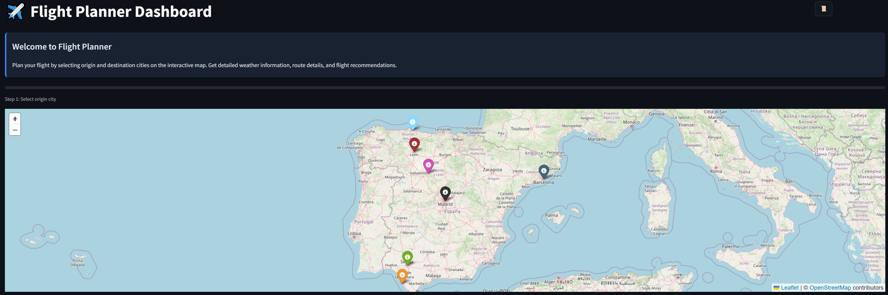
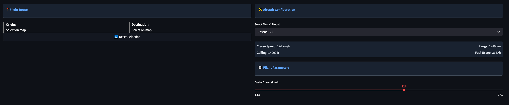
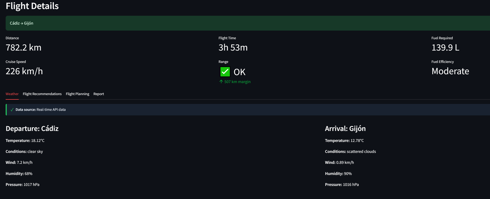

# MissionPlanner

[](https://www.python.org/downloads/)
[](LICENSE)
[](https://flake8.pycqa.org/en/latest/)
[](docs/_build/index.html)

---

A professional Python project for planning flight routes with real-time weather considerations, featuring dark mode support, enhanced UI, and improved aircraft simulation.

<iframe src="https://gifer.com/embed/Lx0q" width=480 height=270.000 frameBorder="0" allowFullScreen></iframe><p><a href="https://gifer.com">
</a></p>

---

## ✈️ Features
- Plan flight routes between Spanish cities with real-time or simulated weather data
- Modern Streamlit-based interactive web interface with dark mode support
- Interactive map and dynamic route visualization
- Aircraft selection with detailed performance specs (including Airbus A320)
- Adjustable flight parameters and altitude profiles with aircraft-specific climb/descent patterns
- Weather-aware flight time estimation and recommendations
- Exportable and printable flight plans (CSV, dark mode reports)
- Route history tracking with improved visual design
- Optimized, tabbed layout for better usability
- Unit tests, code style checks, and Sphinx documentation for reliability and maintainability

## 📦 Requirements
- Python 3.8 or higher
- `requests>=2.28.0`
- `python-dotenv>=0.20.0`
- `streamlit>=1.22.0`
- `folium>=0.14.0`
- `streamlit-folium>=0.11.0`
- `pandas>=1.5.0`
- `numpy>=1.22.0`
- `altair>=4.2.0`
- `matplotlib>=3.5.0`

## 🔑 API Key Usage
MissionPlanner requires an OpenWeatherMap API key for real-time weather data. If you do not provide an API key, the application will automatically use simulated weather data, allowing you to run and test all features without a real API key.

## 🚀 Setup
1. **Clone the repository:**
   ```sh
   git clone https://github.com/your-username/MissionPlanner.git
   cd MissionPlanner
   ```
2. **Install dependencies:**
   ```sh
   pip install -r requirements.txt
   ```
3. **Configure API key:**
   Create a `.env` file in the root directory and add your OpenWeatherMap API key:
   ```env
   API_KEY=your_api_key_here
   ```

## 🛠️ Usage

### Command Line Interface
Run the main script:
```sh
python flight_plan.py
```

### Interactive Web Interface
Launch the Streamlit web interface:
```sh
streamlit run flight_app.py
```

Once launched:
1. **Select Origin & Destination** - Click on city markers in the map
2. **Configure Aircraft** - Choose from available aircraft models (including the Airbus A320)
3. **Adjust Flight Parameters** - Fine-tune cruise speed if desired
4. **View Results** - See route details, weather information, and recommendations in the organized tab interface
5. **Explore Flight Planning** - Check the altitude profile and fuel consumption visualization
6. **Export/Print** - Download or print your flight plan with dark mode support
7. **View History** - Click the history button (📜) to view previous routes with improved visual design

## <span style="font-size:1.5em; font-weight:bold;">📸 Execution Screenshots</span>

<details>
<summary style="">Click to expand</summary>
<br>
<div align="center">
  
  <br>
  
  <br>
  
</div>
</details>

## 🧪 Testing
Run all unit tests:
```sh
python -m unittest discover tests
```

## 🧹 Code Style
Check code style with flake8:
```sh
pip install flake8
flake8 .
```

## 📚 Documentation
Generate HTML documentation with Sphinx:
```sh
pip install sphinx
sphinx-build -b html docs docs/_build
```

Open `docs/_build/index.html` in your browser to view the documentation.

## 🌙 Dark Mode Support
The application features comprehensive dark mode support:
- Semi-transparent dark backgrounds compatible with both light and dark browser themes
- High-contrast text for better readability
- Semantic colors (green for success, orange for warnings, blue for information)
- Dark mode compatible charts and visualizations
- Improved interface for weather data source indication
- Dark mode printable reports

## ✨ Recent Improvements
The application has received several significant enhancements:
- **Airbus A320 Support**: Added with appropriate performance characteristics and fuel units (kg/h)
- **Improved Layout**: Better space utilization with information tabs below the map
- **Enhanced UI**: Redesigned metric cards, selection boxes, and flight info panels
- **Weather Data Indicator**: Visual indication of whether real API or simulated data is used
- **Aircraft-Specific Logic**: Custom climb/descent profiles based on aircraft type

For a complete list of changes, see the [CHANGELOG.md](CHANGELOG.md) file.

## 🤖 Working on...
This project could use GitHub Actions for CI:
- Runs tests on push and pull requests
- Checks code style with flake8
- Builds documentation with Sphinx

## 📄 License
MIT License
